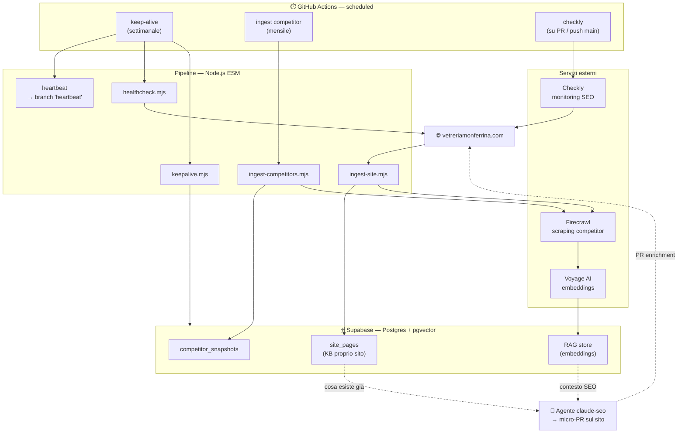

# monferrinoAI 🤖

[](https://github.com/Monferrina/monferrinoAI/actions/workflows/checkly.yml)
[](https://github.com/Monferrina/monferrinoAI/actions/workflows/keepalive.yml)
[](https://github.com/Monferrina/monferrinoAI/actions/workflows/ingest.yml)

[](https://nodejs.org)
[](https://supabase.com)
[](https://github.com/pgvector/pgvector)
[](https://www.voyageai.com)
[](https://www.firecrawl.dev)
[](https://www.checklyhq.com)

[](https://github.com/Monferrina/monferrinoAI/actions)
[](https://codeql.github.com)
[](https://github.com/Monferrina/monferrinoAI/network/updates)
[](https://github.com/Monferrina/monferrinoAI)

---

**Monferrino** è l'agente IA schedulato a supporto di **[vetreriamonferrina.com](https://vetreriamonferrina.com)**: cura SEO/AEO e contenuti, ingerisce l'attività dei competitor in un knowledge base RAG e monitora in continuo lo stato del sito. Gira interamente su **GitHub Actions** (nessun server da mantenere) con **Supabase** come memoria.

## Architettura



## Tech Stack

| Categoria          | Tecnologia                                                  |
| ------------------ | ----------------------------------------------------------- |
| Runtime            | Node.js 22 (ESM, zero-build)                                |
| Database / memoria | Supabase — PostgreSQL                                        |
| RAG                | pgvector + embeddings **Voyage AI**                         |
| Web scraping       | Firecrawl (snapshot competitor)                             |
| Monitoring         | Checkly — monitoring-as-code (SEO health, daily)            |
| Scheduling / CI    | GitHub Actions (cron settimanale + mensile)                 |
| Sicurezza          | CodeQL, Dependabot, secret scanning, ruleset `protect-main` |
| Test               | `node:test` (unit + integration su DB reale)                |

## Struttura

```
.
├── src/
│   ├── db.mjs                  # accesso Supabase (pg) + insert idempotente
│   ├── fetchers.mjs            # scrape (Firecrawl) + embed (Voyage) condivisi
│   └── snapshot.mjs            # normalizzazione snapshot (competitor + sito)
├── scripts/
│   ├── ingest-competitors.mjs  # scraping Firecrawl → embeddings → competitor_snapshots
│   ├── ingest-site.mjs         # scraping proprio sito → embeddings → site_pages (KB)
│   ├── keepalive.mjs           # ping DB (evita pausa Supabase free 7gg)
│   ├── healthcheck.mjs         # health check del sito
│   └── e2e.mjs                 # test end-to-end
├── __checks__/
│   └── seo.check.ts            # monitor Checkly (gruppo Agent-MonferrinoAI)
├── checkly.config.ts
└── .github/
    ├── workflows/              # keepalive · ingest · checkly
    └── dependabot.yml
```

## Workflow schedulati

| Workflow    | Quando              | Cosa fa                                                                       |
| ----------- | ------------------- | ----------------------------------------------------------------------------- |
| `keepalive` | settimanale (lun)   | ping Supabase + health check sito + **heartbeat** (anti-disattivazione 60gg)  |
| `ingest`    | mensile (1°)        | scraping competitor → `competitor_snapshots` + embeddings RAG                 |
| `checkly`   | su PR / push `main` | valida i monitor sulle PR, li deploya su Checkly al merge                      |

> I workflow schedulati girano **solo sul default branch**. Su repo pubblico GitHub li disabilita dopo 60gg di inattività: il keep-alive committa un **heartbeat** su un branch dedicato per mantenere il repo attivo.

## Sviluppo

Requisiti: **Node.js ≥ 22**, **npm ≥ 10**. Segreti in `.env.local` (mai committati).

```bash
npm ci
npm test              # unit + integration (node:test)
npm run healthcheck   # health check del sito
npm run ingest        # ingest competitor (consuma quota Firecrawl/Voyage)
npm run checkly:test  # valida i monitor Checkly
```

## Sicurezza

Policy di segnalazione vulnerabilità in [`SECURITY.md`](./SECURITY.md). Segreti solo in GitHub Secrets / `.env.local`; token dei workflow in sola lettura (least privilege); `main` protetto (solo PR squash, check CodeQL obbligatorio).

## Licenza

All Rights Reserved © Vetreria Monferrina di Fioravanti Giuseppe — Casale Monferrato (AL).
