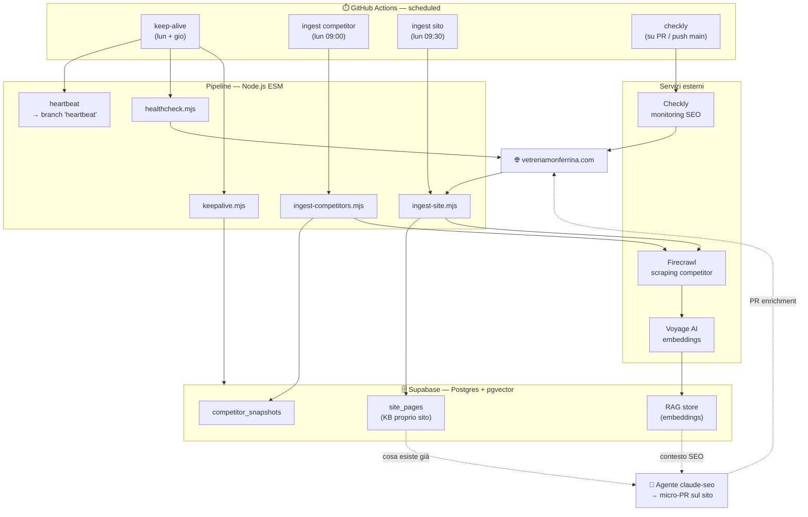

# monferrinoAI 🤖

[](https://github.com/Monferrina/monferrinoAI/actions/workflows/checkly.yml)
[](https://github.com/Monferrina/monferrinoAI/actions/workflows/keepalive.yml)
[](https://github.com/Monferrina/monferrinoAI/actions/workflows/ingest.yml)

[](https://nodejs.org)
[](https://supabase.com)
[](https://github.com/pgvector/pgvector)
[](https://www.voyageai.com)
[](https://www.firecrawl.dev)
[](https://www.checklyhq.com)

[](https://github.com/Monferrina/monferrinoAI/actions)
[](https://codeql.github.com)
[](https://github.com/Monferrina/monferrinoAI/network/updates)
[](https://github.com/Monferrina/monferrinoAI)

---

**Monferrino** è l'agente IA schedulato a supporto di **[vetreriamonferrina.com](https://vetreriamonferrina.com)**: cura SEO/AEO e contenuti, ingerisce l'attività dei competitor in un knowledge base RAG e monitora in continuo lo stato del sito. Gira interamente su **GitHub Actions** (nessun server da mantenere) con **Supabase** come memoria.

## Architettura


```mermaid
flowchart TD
    subgraph GHA["⏱️ GitHub Actions — scheduled"]
        KA["keep-alive<br/>(lun + gio)"]
        ING["ingest competitor<br/>(lun 09:00)"]
        INGS["ingest sito<br/>(lun 09:30)"]
        CHK["checkly<br/>(su PR / push main)"]
    end

    subgraph PIPE["Pipeline — Node.js ESM"]
        KEEP["keepalive.mjs"]
        HEALTH["healthcheck.mjs"]
        HEART["heartbeat<br/>→ branch 'heartbeat'"]
        INGEST["ingest-competitors.mjs"]
        INGSITE["ingest-site.mjs"]
    end

    subgraph EXT["Servizi esterni"]
        FC["Firecrawl<br/>scraping competitor"]
        VOY["Voyage AI<br/>embeddings"]
        CL["Checkly<br/>monitoring SEO"]
    end

    subgraph DB["🗄️ Supabase — Postgres + pgvector"]
        SNAP["competitor_snapshots"]
        SITEPG["site_pages<br/>(KB proprio sito)"]
        RAG["RAG store<br/>(embeddings)"]
    end

    SITE["🌐 vetreriamonferrina.com"]
    AGENT["🤖 Agente claude-seo<br/>→ micro-PR sul sito"]

    KA --> KEEP --> DB
    KA --> HEALTH --> SITE
    KA --> HEART
    ING --> INGEST --> FC --> VOY --> RAG
    INGEST --> SNAP
    INGS --> INGSITE --> FC
    SITE --> INGSITE --> SITEPG
    CHK --> CL --> SITE
    RAG -. contesto SEO .-> AGENT
    SITEPG -. "cosa esiste già" .-> AGENT
    AGENT -. PR enrichment .-> SITE
```

## Tech Stack

| Categoria          | Tecnologia                                                  |
| ------------------ | ----------------------------------------------------------- |
| Runtime            | Node.js 22 (ESM, zero-build)                                |
| Database / memoria | Supabase — PostgreSQL                                        |
| RAG                | pgvector + embeddings **Voyage AI**                         |
| Web scraping       | Firecrawl (snapshot competitor)                             |
| Monitoring         | Checkly — monitoring-as-code (SEO health, daily)            |
| Scheduling / CI    | GitHub Actions (cron settimanale + mensile)                 |
| Sicurezza          | CodeQL, Dependabot, secret scanning, ruleset `protect-main` |
| Test               | `node:test` (unit + integration su DB reale)                |

## Struttura

```
.
├── src/
│   ├── db.mjs                  # accesso Supabase (pg, TLS verify-full) + insert idempotente
│   ├── fetchers.mjs            # scrape (Firecrawl) + embed (Voyage) + redact() PII
│   ├── snapshot.mjs            # normalizzazione snapshot + guardrail anti-injection
│   ├── ingest-gate.mjs         # gate di validità di un run (soglia + lista non vuota)
│   ├── scope-filter.mjs        # blocklist deterministica sul backlog keyword
│   └── ai-log.mjs              # registro attività AI (art. 12) — non bloccante
├── scripts/
│   ├── ingest-competitors.mjs  # scraping Firecrawl → embeddings → competitor_snapshots
│   ├── ingest-site.mjs         # scraping proprio sito → embeddings → site_pages (KB)
│   ├── keepalive.mjs           # ping DB + purga retention (90gg snapshot, 24 mesi log)
│   ├── healthcheck.mjs         # health check del sito (403 dal runner CI = atteso)
│   ├── digest.mjs              # report mensile via Resend
│   ├── backup-db.sh            # dump → R2, TLS verify-full con CA pinnata
│   ├── restore-db.sh           # ripristino da R2 (manuale, ON_ERROR_STOP)
│   └── e2e.mjs                 # test end-to-end della pipeline (consuma crediti)
├── docs/
│   ├── ai-act.md               # documentazione tecnica AI Act + retention + disclosure
│   └── ai-act-classification.md # dossier di autoclassificazione del rischio
├── __checks__/
│   └── seo.check.ts            # monitor Checkly (gruppo Agent-MonferrinoAI)
├── checkly.config.ts
└── .github/
    ├── workflows/              # keepalive · ingest · ingest-site · digest · backup · checkly · release
    └── dependabot.yml
```

## Workflow schedulati

| Workflow       | Quando                | Cosa fa                                                                        |
| -------------- | --------------------- | ------------------------------------------------------------------------------ |
| `keepalive`    | lunedì e giovedì      | ping Supabase, health check sito, **heartbeat** (anti-disattivazione 60gg), purga retention |
| `backup-db`    | lunedì + il 2 del mese | dump dello schema `public` → Cloudflare R2 (prefissi `weekly/` e `monthly/`)   |
| `ingest`       | **lunedì 09:00 UTC**  | scraping competitor → `competitor_snapshots` + embedding RAG                    |
| `ingest-site`  | **lunedì 09:30 UTC**  | scraping del proprio sito → `site_pages` (KB "cosa esiste già")                 |
| `digest`       | il 2 del mese         | report via email (Resend) su posizionamento, competitor e backlog              |
| `checkly`      | su PR / push `main`   | valida i monitor sulle PR, li deploya su Checkly al merge                       |
| `release`      | su release pubblicata | tarball + SBOM CycloneDX, firmati con Sigstore keyless                          |

> I workflow schedulati girano **solo sul default branch**. Su repo pubblico GitHub li disabilita dopo 60gg di inattività: il keep-alive committa un **heartbeat** su un branch dedicato per mantenere il repo attivo. Lo step dell'heartbeat gira con `if: !cancelled()`, così non muore se l'health check fallisce — è la rete di sicurezza, non deve dipendere dallo stato del sito.

### Cadenza settimanale e budget (dal 27/7/2026)

I due ingest erano rispettivamente mensile e **non schedulato affatto**: `site_pages` era rimasto fermo per quasi un mese, quindi l'agente ragionava su una foto vecchia. Ora entrambi girano il lunedì, sfalsati di mezz'ora.

Il costo è verificato, non stimato: piano Firecrawl **1.000 crediti/mese**, 1 credito per pagina. `(30 + 29) × 4,33 settimane ≈ 256 crediti/mese`, cioè il **26% del piano**. Voyage resta irrilevante (~0,3% del free tier) e le Actions su repo pubblico sono gratuite.

Con 4× i run, i guardrail contano 4× di più. Il gate di validità è in `src/ingest-gate.mjs`, condiviso dai due script e coperto da test: oltre alla soglia dell'80% di scrape riusciti, **aborta se la lista URL è vuota** — caso che la vecchia soglia non intercettava, perché `0 < Math.ceil(0 × 0,8)` è falso e un monitor cancellato avrebbe prodotto un run verde a mani vuote ogni settimana.

### Health check: il 403 è atteso

`healthcheck.mjs` riceve **403** dal runner CI: Cloudflare blocca l'IP di GitHub Actions. Lo script lo riconosce, lo dichiara nei log e **non** lo tratta come un down — il monitoraggio autorevole del sito è Checkly. Vedere `⚠ 403` nei log del keep-alive è normale.

## Sviluppo

Requisiti: **Node.js ≥ 22**, **npm ≥ 10**. Segreti in `.env.local` (mai committati).

```bash
npm ci
npm test              # unit + integration (node:test)
npm run healthcheck   # health check del sito
npm run ingest        # ingest competitor (consuma quota Firecrawl/Voyage)
npm run checkly:test  # valida i monitor Checkly
```

## Sicurezza

Policy di segnalazione vulnerabilità in [`SECURITY.md`](./SECURITY.md). Segreti solo in GitHub Secrets / `.env.local`; token dei workflow in sola lettura (least privilege); `main` protetto (solo PR squash, check CodeQL obbligatorio). Le GitHub Actions sono pinnate per SHA e non per tag — i tag sono mobili, ed è il vettore usato nell'attacco a `tj-actions/changed-files`. Un `npm audit --audit-level=high` bloccante in CI formalizza "niente vulnerabilità note al rilascio".

## Verificare una release

Ogni release pubblicata porta un tarball dei sorgenti e una SBOM CycloneDX, firmati con Sigstore keyless via OIDC di GitHub Actions: nessuna chiave da custodire né da ruotare. Un artefatto firmato che nessuno sa verificare è teatro, quindi ecco come si verifica.

```bash
TAG=v0.1.0
gh release download "$TAG" --repo Monferrina/monferrinoAI

# Provenance: da quale commit, quale workflow, quale runner
gh attestation verify "monferrino-$TAG.tar.gz" --repo Monferrina/monferrinoAI

# SBOM: l'elenco dei componenti, legato a quel tarball
gh attestation verify "monferrino-$TAG.tar.gz" \
  --repo Monferrina/monferrinoAI --predicate-type https://cyclonedx.org/bom
```

La SBOM elenca le sole dipendenze **runtime** (`--omit dev`): è ciò che serve per rispondere in 24 ore alla domanda «questa CVE ci tocca?», che è il motivo per cui il CRA la richiede.

## Licenza

**All Rights Reserved** © Vetreria Monferrina di Fioravanti Giuseppe — Casale Monferrato (AL).

Il codice è pubblico a scopo dimostrativo. Non esiste alcun file `LICENSE` e **non è concessa alcuna licenza d'uso**: nessun permesso di riuso, redistribuzione od opere derivate. Un repository pubblico senza licenza è legalmente già così — scriverlo serve a non lasciare in giro l'ambiguità con le aspettative open source.
