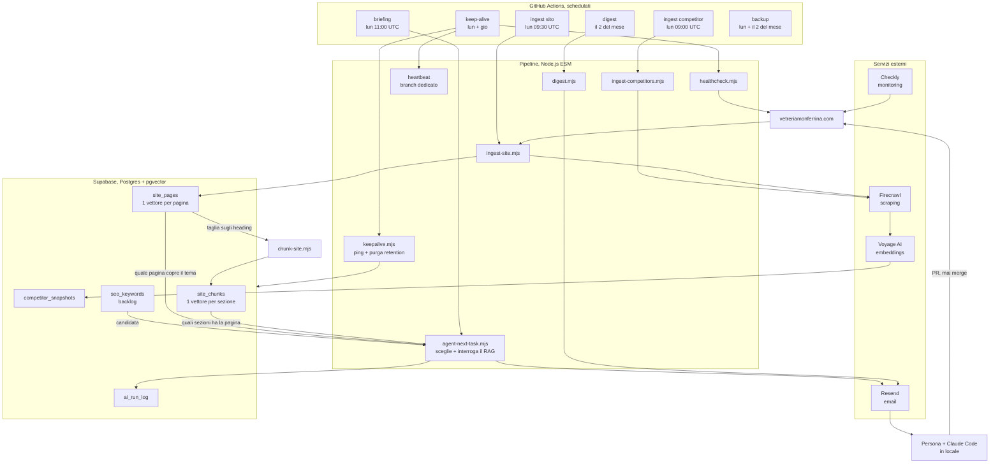

# monferrinoAI

[](https://github.com/Monferrina/monferrinoAI/actions/workflows/checkly.yml)
[](https://github.com/Monferrina/monferrinoAI/actions/workflows/keepalive.yml)
[](https://github.com/Monferrina/monferrinoAI/actions/workflows/ingest.yml)

[](https://nodejs.org)
[](https://supabase.com)
[](https://github.com/pgvector/pgvector)
[](https://www.voyageai.com)
[](https://www.firecrawl.dev)
[](https://resend.com)
[](https://www.checklyhq.com)

[](https://github.com/Monferrina/monferrinoAI/actions)
[](https://codeql.github.com)
[](https://github.com/Monferrina/monferrinoAI/network/updates)
[](https://github.com/Monferrina/monferrinoAI)

---

**Monferrino** è l'agente schedulato che lavora per [vetreriamonferrina.com](https://vetreriamonferrina.com): tiene una base di conoscenza del sito e dei competitor su Supabase, sorveglia lo stato della produzione e ogni lunedì propone il prossimo contenuto da scrivere. Gira su GitHub Actions, senza alcun server da mantenere.

Non scrive contenuto da solo. Sceglie il lavoro, prepara il contesto e manda un briefing per email: l'articolo lo scrive una persona, e il merge lo decide il titolare. È una scelta, non una limitazione tecnica, e il perché è spiegato in [Cosa fa e cosa non fa](#cosa-fa-e-cosa-non-fa).

## Architettura


```mermaid
flowchart TD
    subgraph GHA["GitHub Actions, schedulati"]
        KA["keep-alive<br/>lun + gio"]
        ING["ingest competitor<br/>lun 09:00 UTC"]
        INGS["ingest sito<br/>lun 09:30 UTC"]
        BRIEF["briefing<br/>lun 11:00 UTC"]
        DIG["digest<br/>il 2 del mese"]
        BK["backup<br/>lun + il 2 del mese"]
    end

    subgraph PIPE["Pipeline, Node.js ESM"]
        KEEP["keepalive.mjs<br/>ping + purga retention"]
        HEALTH["healthcheck.mjs"]
        HEART["heartbeat<br/>branch dedicato"]
        INGEST["ingest-competitors.mjs"]
        INGSITE["ingest-site.mjs"]
        NEXT["agent-next-task.mjs<br/>sceglie + interroga il RAG"]
        DIGEST["digest.mjs"]
    end

    subgraph EXT["Servizi esterni"]
        FC["Firecrawl<br/>scraping"]
        VOY["Voyage AI<br/>embeddings"]
        RS["Resend<br/>email"]
        CL["Checkly<br/>monitoring"]
    end

    subgraph DB["Supabase, Postgres + pgvector"]
        SNAP["competitor_snapshots"]
        SITEPG["site_pages<br/>1 vettore per pagina"]
        CHUNK["site_chunks<br/>1 vettore per sezione"]
        KW["seo_keywords<br/>backlog"]
        LOG["ai_run_log"]
    end

    SITE["vetreriamonferrina.com"]
    PERSONA["Persona + Claude Code<br/>in locale"]

    KA --> KEEP --> DB
    KA --> HEALTH --> SITE
    KA --> HEART
    ING --> INGEST --> FC --> VOY --> SNAP
    INGS --> INGSITE --> FC
    SITE --> INGSITE --> SITEPG
    SITEPG -- "taglia sugli heading" --> CHUNKER["chunk-site.mjs"] --> CHUNK
    BRIEF --> NEXT
    KW -- "candidata" --> NEXT
    SITEPG -- "quale pagina copre il tema" --> NEXT
    CHUNK -- "quali sezioni ha la pagina" --> NEXT
    NEXT --> RS --> PERSONA
    NEXT --> LOG
    PERSONA -- "PR, mai merge" --> SITE
    DIG --> DIGEST --> RS
    CL --> SITE
```

## Cosa fa e cosa non fa

Automatico è il contorno: raccogliere i dati, tenerli freschi, scegliere su cosa vale la pena scrivere, dire cosa il sito copre già. Manuale è il centro: scrivere l'articolo e decidere se pubblicarlo.

La generazione headless in CI era già scritta e funzionante sulla carta, poi scartata. Serviva una chiave API di modello e un token cross-repo via GitHub App, cioè due credenziali permanenti in più da custodire per far girare un job una volta a settimana. Scrivere in sessione interattiva costa zero, perché è coperto da un abbonamento che esiste già, e tiene la persona dentro il ciclo per costruzione invece che per policy. La sorveglianza umana dell'art. 14 dell'AI Act qui non è una promessa nel dossier: non esistono proprio le credenziali per aggirarla.

Il dettaglio sta in [`docs/ai-act.md`](./docs/ai-act.md) §3.3.

## Il briefing del lunedì

`scripts/agent-next-task.mjs` pesca dal backlog `seo_keywords` la candidata con più volume fra quelle ancora da fare, cerca nel RAG le tre pagine del sito semanticamente più vicine e manda il tutto per email.

Due dettagli che sembrano minori e non lo sono.

La ricerca nel RAG non usa la sola keyword. Provata contro il database reale, la keyword secca è sempre la query peggiore: su `docce` restituiva distanza 0,77 e pescava `/blog` invece di `/servizi/box-doccia`, che è la sua stessa `target_page`. Accodando `cluster` e `target_page` la distanza scende a 0,47 e la pagina giusta arriva prima su tutte e sei le candidate provate.

Dopo l'invio la keyword passa a `briefed`. Senza quella riga lo script sarebbe deterministico e rimanderebbe la stessa candidata ogni lunedì, per sempre. La marcatura avviene dopo l'email e mai prima: se Resend fallisce la riga resta `todo` e torna la settimana dopo, mentre il caso opposto perderebbe la candidata in silenzio.

### Due livelli di RAG

`site_pages` tiene un vettore per pagina intera e risponde a "questo tema esiste già sul sito?", che è la domanda giusta per le 46 keyword `faq`, dove si scrive un pezzo nuovo.

`site_chunks` tiene un vettore per sezione, tagliata sugli heading del markdown. Serve alle 52 keyword `onpage-enrich`, dove la pagina esiste già e la domanda è "com'è fatta e dove ci sta il pezzo nuovo". Il briefing elenca le sezioni della pagina target in ordine di lettura.

Una avvertenza onesta sulle distanze delle sezioni: sono vicine fra loro, con uno scarto misurato fra 0,01 e 0,15. Una pagina di quattro sezioni sul box doccia parla di box doccia in tutte e quattro, quindi il valore di quell'elenco è la struttura, non la classifica. Su un caso su quattro (pulizia e anticalcare) la sezione giusta si stacca davvero, sugli altri no.

I chunk si derivano da `site_pages` senza ri-scrapare: il markdown è già nel database, quindi `chunk-site.mjs` non consuma un credito Firecrawl. Le 29 pagine danno 157 chunk, mediana 453 caratteri.

### Perché la scrittura non usa una skill di blogging

Le skill `claude-blog` e `claude-seo` vivono dentro Claude Code, quindi in CI non esistono: il workflow del lunedì fa una query SQL, un embedding e una POST a Resend, e non c'è niente che possa leggerle.

Anche nella metà umana, però, `blog-write` è stata valutata e scartata. Porta con sé default pensati per blog di content marketing che vanno contro le regole editoriali del sito: 2.000-2.500 parole invece di 900-1.400, da 8 a 12 statistiche da fonti esterne dove le regole vietano i numeri non verificabili, immagini da Pixabay o Unsplash dove sono ammessi solo i file già presenti nel repo, grafici SVG, video YouTube incorporati dove gli iframe sono vietati, e output in MDX mentre gli articoli vivono in un array TypeScript.

Resta utile a pezzo finito: `/blog-seo-check` valida title, meta description, gerarchia degli heading e testo alternativo delle immagini, e su quello non ha opinioni editoriali.

Il briefing del lunedì porta i passi scritti dentro l'email, così l'unico punto in cui l'automazione consegna il lavoro a una persona non è muto.

Nel briefing non entra una riga di testo scrapato. Del RAG escono solo URL e distanze, per scelta: il contenuto delle pagine è materiale di terzi, e ciò che non entra nel briefing non può entrare nel prompt. Le regole per chi scrive stanno in [`prompts/genera-articolo.md`](./prompts/genera-articolo.md), verificabili contro i payload di `test/prompt-injection-fixtures.mjs`.

## Stack

| Categoria          | Tecnologia                                                 |
| ------------------ | ---------------------------------------------------------- |
| Runtime            | Node.js 22 (ESM, zero-build)                               |
| Database e memoria | Supabase, PostgreSQL                                       |
| RAG                | pgvector con embeddings Voyage AI                          |
| Web scraping       | Firecrawl                                                  |
| Email              | Resend (digest mensile e briefing settimanale)             |
| Monitoring         | Checkly, monitoring-as-code                                |
| Scheduling e CI    | GitHub Actions                                             |
| Sicurezza          | CodeQL, Dependabot, secret scanning, ruleset protect-main  |
| Test               | `node:test` (unit e integration su DB reale)               |

## Struttura

```
.
├── src/
│   ├── db.mjs                  # accesso Supabase (pg, TLS verify-full) + insert idempotente
│   ├── fetchers.mjs            # scrape (Firecrawl) + embed (Voyage) + redact() PII
│   ├── snapshot.mjs            # normalizzazione snapshot + guardrail anti-injection
│   ├── ingest-gate.mjs         # gate di validità di un run (soglia + lista non vuota)
│   ├── scope-filter.mjs        # blocklist deterministica sul backlog keyword
│   ├── chunker.mjs             # taglio del markdown sulle sezioni + filtro navigazione
│   ├── mailer.mjs              # invio Resend condiviso, con fetch iniettabile
│   └── ai-log.mjs              # registro attività AI (art. 12), non bloccante
├── scripts/
│   ├── ingest-competitors.mjs  # scraping Firecrawl → embeddings → competitor_snapshots
│   ├── ingest-site.mjs         # scraping proprio sito → embeddings → site_pages
│   ├── chunk-site.mjs          # site_pages → sezioni → embeddings → site_chunks (no scrape)
│   ├── agent-next-task.mjs     # sceglie la keyword, interroga il RAG, spedisce il briefing
│   ├── keepalive.mjs           # ping DB + purga retention (90gg snapshot, 24 mesi log)
│   ├── healthcheck.mjs         # health check del sito (403 dal runner CI è atteso)
│   ├── digest.mjs              # report mensile via Resend
│   ├── backup-db.sh            # dump → R2, TLS verify-full con CA pinnata
│   ├── restore-db.sh           # ripristino da R2 (manuale, ON_ERROR_STOP)
│   └── e2e.mjs                 # test end-to-end della pipeline (consuma crediti)
├── prompts/
│   └── genera-articolo.md      # istruzioni per chi scrive l'articolo, con le regole §3
├── docs/
│   ├── ai-act.md               # documentazione tecnica AI Act, retention, disclosure
│   └── ai-act-classification.md # dossier di autoclassificazione del rischio
├── __checks__/
│   └── seo.check.ts            # monitor Checkly (gruppo Agent-MonferrinoAI)
├── checkly.config.ts
└── .github/
    ├── workflows/              # keepalive · ingest · ingest-site · agent · digest · backup · checkly · release
    └── dependabot.yml
```

## Workflow schedulati

| Workflow      | Quando                 | Cosa fa                                                                                     |
| ------------- | ---------------------- | ------------------------------------------------------------------------------------------- |
| `keepalive`   | lunedì e giovedì       | ping Supabase, health check sito, heartbeat anti-disattivazione, purga retention             |
| `backup-db`   | lunedì e il 2 del mese | dump dello schema `public` verso Cloudflare R2 (prefissi `weekly/` e `monthly/`)             |
| `ingest`      | lunedì 09:00 UTC       | scraping competitor verso `competitor_snapshots`, con embedding RAG                          |
| `ingest-site` | lunedì 09:30 UTC       | scraping del proprio sito verso `site_pages`, poi ricostruzione di `site_chunks`             |
| `agent`       | lunedì 11:00 UTC       | sceglie la keyword dal backlog e ne spedisce il briefing via email                           |
| `digest`      | il 2 del mese          | report via email su posizionamento, competitor e stato del backlog                           |
| `checkly`     | su PR e push su `main` | valida i monitor sulle PR, li deploya su Checkly al merge                                     |
| `release`     | su release pubblicata  | tarball e SBOM CycloneDX, firmati con Sigstore keyless                                        |

L'orario del briefing non è casuale: l'ingest del sito ha timeout di 30 minuti, quindi nel caso peggiore finisce alle 10:00. Un'ora di margine costa nulla e garantisce che il RAG interrogato sia quello aggiornato.

I workflow schedulati girano solo sul default branch. Su repo pubblico GitHub li disabilita dopo 60 giorni di inattività, quindi il keep-alive committa un heartbeat su un branch dedicato per tenere il repo attivo. Quello step gira con `if: !cancelled()`, così non muore insieme all'health check: è la rete di sicurezza, non deve dipendere dallo stato del sito.

### Cadenza settimanale e budget

I due ingest erano rispettivamente mensile e non schedulato affatto, quindi `site_pages` era rimasto fermo per quasi un mese e l'agente ragionava su una foto vecchia. Ora girano entrambi il lunedì, sfalsati di mezz'ora.

Il costo è verificato, non stimato: piano Firecrawl da 1.000 crediti al mese, 1 credito per pagina, `(30 + 29) × 4,33 settimane ≈ 256 crediti al mese`, cioè il 26% del piano. Voyage resta irrilevante, sotto l'1% del free tier, e le Actions su repo pubblico sono gratuite.

Con quattro volte i run, i guardrail contano quattro volte di più. Il gate di validità sta in `src/ingest-gate.mjs`, condiviso dai due script e coperto da test: oltre alla soglia dell'80% di scrape riusciti, aborta se la lista URL è vuota. Quel caso la vecchia soglia non lo intercettava, perché `0 < Math.ceil(0 × 0,8)` è falso, e un monitor cancellato avrebbe prodotto un run verde a mani vuote ogni settimana.

### Health check: il 403 è atteso

`healthcheck.mjs` riceve 403 dal runner CI, perché Cloudflare blocca l'IP di GitHub Actions. Lo script lo riconosce, lo dichiara nei log e non lo tratta come un down: il monitoraggio autorevole del sito è Checkly. Vedere `⚠ 403` nei log del keep-alive è normale.

## Sviluppo

Servono Node.js 22 o superiore e npm 10 o superiore. I segreti stanno in `.env.local`, che non viene mai committato.

```bash
npm ci
npm test                      # unit e integration (node:test)
npm run healthcheck           # health check del sito
npm run briefing              # briefing su stdout, non invia nulla
npm run briefing -- --email   # invia davvero e marca la keyword
npm run chunk                 # rifà i chunk delle pagine cambiate (niente scrape)
npm run chunk -- --force      # ricostruisce tutti i chunk, dopo modifiche al chunker
npm run ingest                # ingest competitor (consuma quota Firecrawl e Voyage)
npm run checkly:test          # valida i monitor Checkly
```

`npm run briefing` senza argomenti è di sola lettura: stampa il JSON e non tocca niente. Con `--dry-run` non apre nemmeno la connessione e usa dati di esempio, che è il modo di provare la forma dell'email senza consumare crediti.

## Sicurezza

La policy di segnalazione vulnerabilità sta in [`SECURITY.md`](./SECURITY.md). I segreti vivono solo in GitHub Secrets o in `.env.local`, i token dei workflow sono in sola lettura, `main` è protetto con sole PR squash e CodeQL obbligatorio.

Le GitHub Actions sono pinnate per SHA e non per tag. I tag sono mobili, ed è il vettore usato nell'attacco a `tj-actions/changed-files`. Un `npm audit --audit-level=high` bloccante in CI rende "niente vulnerabilità note al rilascio" una condizione verificata invece che una buona intenzione.

## Verificare una release

Ogni release pubblicata porta un tarball dei sorgenti e una SBOM CycloneDX, firmati con Sigstore keyless via OIDC di GitHub Actions: nessuna chiave da custodire né da ruotare. Un artefatto firmato che nessuno sa verificare è teatro, quindi ecco come si verifica.

```bash
TAG=v0.1.0
gh release download "$TAG" --repo Monferrina/monferrinoAI

# Provenance: da quale commit, quale workflow, quale runner
gh attestation verify "monferrino-$TAG.tar.gz" --repo Monferrina/monferrinoAI

# SBOM: l'elenco dei componenti, legato a quel tarball
gh attestation verify "monferrino-$TAG.tar.gz" \
  --repo Monferrina/monferrinoAI --predicate-type https://cyclonedx.org/bom
```

La SBOM elenca le sole dipendenze runtime (`--omit dev`): è ciò che serve per rispondere in 24 ore alla domanda «questa CVE ci tocca?», che è poi il motivo per cui il CRA la richiede.

## Licenza

All Rights Reserved © Vetreria Monferrina di Fioravanti Giuseppe, Casale Monferrato (AL).

Il codice è pubblico a scopo dimostrativo. Non esiste alcun file `LICENSE` e non è concessa alcuna licenza d'uso: nessun permesso di riuso, redistribuzione o opere derivate. Un repository pubblico senza licenza è legalmente già così, ma scriverlo evita l'ambiguità con le aspettative open source.
