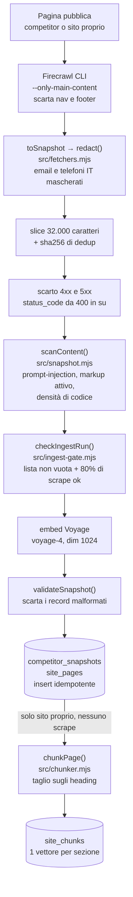

# MonferrinoSEO, documentazione tecnica AI Act

> Documentazione tecnica del sistema di IA a supporto della conformità al
> Regolamento (UE) 2024/1689 (AI Act). Base per la revisione legale (DPIA/FRIA).
>
> Ultimo aggiornamento: 2026-07-27. Scadenza compliance target: 2026-08-02, rispettata (v. §8).

## 1. Identificazione del sistema

Il sistema si chiama MonferrinoSEO ed è l'agente IA del repo `Monferrina/monferrinoAI`. Il
titolare è Vetreria Monferrina.

La finalità è far crescere la visibilità organica e le citazioni AI del sito
`vetreriamonferrina.com` tramite interventi piccoli e verificabili: micro-PR di contenuto
SEO/AEO, monitoraggio competitor, digest periodici e briefing settimanale sul prossimo
contenuto da scrivere.

Il principio operativo è che l'agente propone e documenta, mentre l'umano supervisiona e
approva. Nessuna modifica va in produzione senza revisione umana.

## 2. Classificazione del rischio

Il sistema **non** rientra tra le pratiche vietate (art. 5) né tra i sistemi ad
alto rischio dell'Allegato III (non tratta biometria, occupazione, credito,
servizi essenziali, giustizia, ecc.). È uno strumento di supporto al marketing
con output testuali sempre mediati da revisione umana.

Rientra negli **obblighi di trasparenza** (art. 50) per i contenuti generati o
assistiti dall'IA. Il progetto adotta comunque, in via cautelativa e proporzionata,
misure tipiche dei sistemi ad alto rischio (documentazione tecnica, logging delle
attività, oversight umano) per robustezza e tracciabilità.

L'esito della classificazione e la posizione su DPIA e FRIA sono nel §8.1 e nel dossier
[`ai-act-classification.md`](./ai-act-classification.md).

## 3. Descrizione del sistema

### 3.1 Componenti

| Componente | Ruolo | Tecnologia |
|-----------|-------|-----------|
| Ingest competitor | Scrape periodico pagine competitor, embed, DB | `scripts/ingest-competitors.mjs`, Firecrawl, Voyage |
| Ingest sito | Scrape pagine proprie, embed, DB (RAG a livello di pagina) | `scripts/ingest-site.mjs` |
| Chunking del sito | Taglia le pagine già in KB nelle loro sezioni e le embedda una per una, senza ri-scrapare | `src/chunker.mjs`, `scripts/chunk-site.mjs` |
| Monitor competitor | Rilevamento cambi pagine (Firecrawl monitor) | monitor id `019f1363-7672-736b-af55-3e04baad06fd` |
| Store / RAG | Snapshot ed embedding vettoriali | Supabase Postgres con pgvector |
| Briefing settimanale | Sceglie una keyword dal backlog, interroga il RAG, manda il briefing per email | `.github/workflows/agent.yml`, `scripts/agent-next-task.mjs` |
| Digest | Report periodico via email | `scripts/digest.mjs` |
| Invio email | Client Resend condiviso fra digest e briefing, con escaping HTML dei valori dal DB | `src/mailer.mjs` |
| Registro attività | Log delle operazioni automatiche | tabella `public.ai_run_log`, `src/ai-log.mjs` |
| Backup | Dump schema su object storage | `scripts/backup-db.sh`, Cloudflare R2 |

### 3.1.1 Inventario dei modelli (*model discovery*)

Un solo modello gira dentro questo repo, e non è generativo.

| Modello | Fornitore | Versione | Cosa fa | Dove | Cosa vede | Cosa può fare |
|---|---|---|---|---|---|---|
| `voyage-4` | Voyage AI | dim **1024** | Embedding testuali (`input_type: document` per la KB, `query` per la ricerca) | `src/fetchers.mjs`, funzione `embed()` | Markdown **già redatto** da `redact()` (email e telefoni mascherati) | Restituire vettori. Nient'altro: non genera testo, non decide, non scrive |

**Nessun modello generativo è presente in questo repository.** Le proposte di
contenuto del §3.2 nascono in **sessione interattiva** con un assistente esterno
(vedi §3.3, livello «assistito»). In `src/` e in `scripts/` l'unica chiamata a un modello è
la POST a `api.voyageai.com` di `src/fetchers.mjs`: non esiste alcuna chiamata a un'API di
completion o chat. Chi cerca il confine dell'autonomia lo trova qui, perché il repo sa
**leggere e ricordare**, non sa **scrivere da solo**.

Firecrawl non è un modello: è uno scraper. Compare in questo inventario solo per
escluderlo esplicitamente, come richiede la pratica di *model discovery*, che chiede di
dichiarare anche ciò che AI **non** è.

### 3.2 Flusso dati (input, output)

In ingresso ci sono contenuti web pubblici (pagine competitor e pagine proprie), keyword da
strumenti SEO e dati di posizionamento.

L'elaborazione è una catena fissa: scrape, redazione PII, validazione, guardrail
anti-injection, embedding Voyage, recupero semantico dal RAG, e infine proposta di contenuto
on-page scritta a mano in sessione interattiva.

In uscita ci sono Pull Request sul repo del sito con arricchimenti di contenuto (mai
auto-merge), il digest mensile e il briefing settimanale. Nessuna decisione automatizzata con
effetti giuridici su persone.

#### Le barriere prima dello storage sono in serie

Il punto non è che le barriere sul contenuto esistono, ma che stanno **tutte a monte
dell'embedding**: quello che viene scartato non arriva mai a Voyage, non finisce nel database e
non entra nel RAG. L'ordine qui sotto è quello dei due script di ingest, identico in entrambi.
La sola verifica a valle è `validateSnapshot()`, che controlla la forma del record (URL, hash
coerente, embedding della dimensione giusta) e non il suo contenuto.

Due conseguenze che il solo elenco non renderebbe. La redazione PII avviene in `toSnapshot`,
cioè prima dell'hash di dedup: il testo conservato, il vettore e l'identificatore di
duplicato nascono tutti dalla versione già redatta. E `site_chunks` non aggiunge una
superficie di raccolta, perché deriva da `site_pages` che è già passata da tutte le barriere.

#### Mappa dati e AI: fonte, tabella, chi legge

Risponde alla domanda che un audit fa per prima, cioè quali dati alimentano il RAG, da
dove arrivano, e cosa può uscirne.

| Fonte | Come entra | Dove finisce | Chi la legge | Cosa ne esce |
|---|---|---|---|---|
| Pagine pubbliche del competitor | Firecrawl `--only-main-content`, lista URL curata dal monitor | `public.competitor_snapshots` (markdown redatto + embedding 1024) | Recupero semantico in sessione assistita | Analisi di keyword-gap. **Mai** ripubblicazione |
| Pagine pubbliche del sito proprio (`vetreriamonferrina.com`) | `scripts/ingest-site.mjs`, stesso percorso | `public.site_pages`, un vettore per pagina | Il briefing settimanale, per sapere «cosa esiste già» | URL e distanza coseno nel briefing. Evita contenuti duplicati |
| Sezioni delle pagine proprie | `scripts/chunk-site.mjs`, derivate da `site_pages`, nessuno scrape aggiuntivo | `public.site_chunks`, un vettore per sezione | Il briefing settimanale, per le keyword `onpage-enrich` | Heading e distanza coseno nel briefing. Mai il testo della sezione |
| Backlog keyword da strumenti SEO | Import e `scripts/scope-filter.mjs` | `public.seo_keywords` | Il briefing settimanale | La candidata della settimana |
| Esito dei job automatici | `src/ai-log.mjs` | `public.ai_run_log` | Digest mensile e diagnosi | Report via email (Resend) |

La prima barriera del diagramma ha un ceiling dichiarato: `redact()` maschera email e
telefoni italiani via regex, ma i nomi propri non sono coperti e servirebbe un NER (v. §6.1).

Fuori di qui i dati li trattano Firecrawl (scraping), Voyage AI (embedding),
Supabase (storage), Resend (email di digest e briefing) e Cloudflare R2 (backup cifrati).
Nessuno di questi riceve dati personali di clienti: le richieste di preventivo
vivono sul sito, in un'altra proprietà, e non entrano mai in questa pipeline.

### 3.3 Livello di autonomia

Oggi il livello è **assistito**. Le PR sono aperte in sessione interattiva con revisione
contestuale, e il merge è sempre umano.

Automatizzata è solo la **scelta del lavoro**, non la sua esecuzione: il workflow
`Briefing settimanale` (`.github/workflows/agent.yml`) pesca dal backlog una keyword,
interroga il RAG e ne manda il briefing per email. Non scrive contenuto, non tocca il
repo del sito, non ha credenziali di modello e i suoi permessi GitHub sono `contents: read`.

La generazione headless in CI, cioè un workflow che apre PR da solo, è stata **valutata e non
adottata**: avrebbe richiesto una chiave API di modello e un token cross-repo via
GitHub App, cioè due credenziali permanenti in più per un job settimanale. Scrivere in
sessione interattiva tiene la persona dentro il ciclo per costruzione, non per policy.
Se un domani si riapre, i vincoli restano quelli: token short-lived (GitHub App, non PAT),
least-privilege sul solo repo del sito, gate di revisione umana, budget per run.

## 4. Sorveglianza umana (art. 14)

Il human gate vale su **ogni** PR: nulla arriva in produzione senza approvazione umana
esplicita con merge manuale. È la mitigazione chiave, già in atto, e l'auto-merge è stato
rimosso anche dai workflow automatici (per esempio l'aggiornamento delle recensioni), così le
PR restano aperte in attesa di revisione.

Sull'anti prompt-injection i dati esterni (scrape, DB) sono trattati come **non fidati** e le
istruzioni contenute nei contenuti raccolti non vengono eseguite. La barriera non è solo un
principio: `scanContent()` in `src/snapshot.mjs` scarta gli snapshot avvelenati **prima**
dell'embedding, con test su ogni payload coperto in `test/prompt-injection-fixtures.mjs`.
La seconda linea è `prompts/genera-articolo.md` §3, che dichiara cosa è dato e cosa è
istruzione per chi scrive l'articolo.

Verifica di output handling, 2026-07-26. Una review indipendente ha tracciato ogni percorso
in cui contenuto non fidato potrebbe raggiungere un sink e ha verificato tre cose: nessuna
query SQL è costruita per concatenazione (tutti i valori passano da parametri `$n`), nessun
output di modello viene consumato programmaticamente, e l'HTML delle email escapa il testo che
arriva dal DB (`esc()` in `src/mailer.mjs`). La stessa review ha trovato un buco reale nel
guardrail, una frase italiana che sfuggiva alla regex perché il gruppo dei determinanti era
ripetibile una volta sola, corretto e coperto da test di regressione. È il motivo per cui
questa riga dice *verificato* e non *presumibilmente sicuro*.

## 5. Registro delle attività (art. 12, logging)

Tabella `public.ai_run_log` (Supabase), popolata da ogni job automatico:

| Colonna | Contenuto |
|--------|-----------|
| `job` | operazione: `ingest-competitors`, `ingest-site`, `chunk-site`, `digest`, `agent-briefing` |
| `status` | `ok` \| `error` |
| `summary` | esito leggibile |
| `meta` | contatori strutturati (jsonb) |
| `started_at` / `finished_at` | finestra temporale del run |

I cinque valori di `job` sono quelli realmente scritti dal codice, uno per script che chiama
`logAiRun()`. Non esiste un job che apra PR: la generazione headless è stata valutata e non
adottata (§3.3).

Il logging è **non bloccante** (`src/ai-log.mjs`): un errore di registrazione non
fa mai fallire il job tracciato. RLS abilitata e forzata, con `revoke` su anon e auth, quindi
nessun accesso via API pubblica.

## 6. Dati e privacy

I contenuti raccolti sono **pagine web pubbliche** e non è finalità del sistema trattare dati
personali. Le recensioni Google mostrate sul sito sono aggregati pubblici, e
l'`aggregateRating` self-serving è stato rimosso dallo structured data per scelta SEO e
prudenza.

I segreti (chiavi API, credenziali DB) stanno solo in `.env.local` e nei GitHub Secrets, mai
nel codice. Il TLS verso il DB è in modalità **verify-full**, con la CA Supabase pinnata.

### 6.0 Retention: cosa si tiene, per quanto, perché

Dichiarata qui perché «per sempre» non è una politica: è l'assenza di una politica.

| Dato | Dove | Per quanto | Come sparisce |
|---|---|---|---|
| Snapshot competitor (`competitor_snapshots`) | Supabase (`eu-west-3`, Parigi) | **90 giorni** dallo scrape | Automatico, `DELETE` in `scripts/keepalive.mjs` che gira 2 volte a settimana (lunedì e giovedì), quindi età massima effettiva circa 94 giorni |
| Registro attività (`ai_run_log`) | Supabase | **24 mesi** (730 giorni) | Automatico, stessa purga nel keepalive. Orizzonte più lungo perché serve alla tracciabilità (art. 12), non a conservare testo |
| KB del sito proprio (`site_pages`) | Supabase | **Nessuna cancellazione**, v. ceiling | Insert idempotente `ON CONFLICT (url, content_hash) DO NOTHING`: ogni versione diversa di una pagina aggiunge una riga |
| Sezioni del sito proprio (`site_chunks`) | Supabase | **Nessuna cancellazione a tempo** | Deriva da `site_pages` e segue la stessa politica. Quando una pagina cambia, i suoi chunk vecchi vengono cancellati e riscritti in transazione, quindi la tabella non accumula versioni |
| Backup del DB | Cloudflare R2 | Lifecycle rule per prefisso su R2, non dal codice | Automatico lato R2 |
| Log di esecuzione dei workflow | GitHub Actions | Retention di default GitHub | Automatico |

La retention degli snapshot è un obbligo GDPR di limitazione della conservazione
(art. 5(1)(e)) perché lo scraping può intercettare PII residua nonostante `redact()`;
quella di `ai_run_log`, `site_pages` e `site_chunks` è igiene di ROT, cioè *redundant,
obsolete, trivial*.

Il ceiling dichiarato riguarda `site_pages`, che è **append-only**. Contiene solo pagine del
sito proprio, quindi nessun dato di terzi e nessuna PII di clienti, e cresce di una riga per
versione pubblicata, cioè poche decine di righe l'anno. Una purga costerebbe più di quel che
recupera. Da rivedere se il sito passasse a volumi di contenuto molto maggiori.

### 6.1 Posture di conformità della pipeline Firecrawl

Sul fronte GDPR la misura è la minimizzazione della PII. Il markdown scrapato è redatto da
`redact()` (`src/fetchers.mjs`) **prima** di embedding, storage e hash di dedup: la redazione
avviene una sola volta, in `toSnapshot` (`src/snapshot.mjs`), che è l'unico punto in cui si
costruisce `content_md`, e copre quindi sia i competitor sia il sito. Maschera email e
telefoni italiani via regex, sostituendoli con `[email]` e `[tel]`, e si applica anche a
`title` e `description`, perché un recapito nella meta description non deve restare in chiaro
mentre lo stesso numero nel corpo diventa `[tel]`. Lo scrape usa `--only-main-content`, che già
scarta nav e footer, dove si annidano i recapiti. Il ceiling è che i nomi propri **non** sono
coperti e servirebbe un NER: accettabile per pagine competitor B2B di edilizia, da rivalutare
solo se un audit lo richiede.

Sul fronte TDM e copyright (art. 4 Dir. UE 2019/790), Firecrawl cloud rispetta il
`robots.txt` di default e non è stato disabilitato. La lista URL è **curata** dal monitor e
riguarda pagine pubbliche, senza crawl largo: nessun bypass di login, paywall o CAPTCHA, e
nessun aggiramento di barriere tecniche o di opt-out. I dati servono ad analisi di
**keyword-gap**, che è uso lecito, non a replicare o ripubblicare i contenuti altrui.
Sull'identificazione del crawler c'è un limite dichiarato: la CLI Firecrawl non espone un flag
di User-Agent personalizzato (verificato su `firecrawl scrape --help`), quindi lo User-Agent
**non è impostato**. Il rispetto del robots resta garantito lato servizio.

Sul fronte AI Act il rischio è **minimo**: uso interno esclusivo per audit SEO, output sempre
mediati da revisione umana, nessun impatto sui diritti degli interessati.

## 7. Gestione del rischio e mitigazioni

| Rischio | Mitigazione |
|--------|-------------|
| Contenuto errato o allucinato in produzione | Human gate su ogni PR, più i gate della CI (`npm audit --audit-level=high`, `npm run lint`, `node --test`) |
| Prompt injection da contenuti scrapati | Dati esterni non fidati, `scanContent()` all'ingest, §3 di `prompts/genera-articolo.md` in sessione |
| Inquinamento del RAG | Validazione snapshot e scarto delle pagine 4xx/5xx prima dell'embed |
| Fallimenti silenziosi dei job | `checkIngestRun()` con soglia minima di successo e lista non vuota, alert email sul fallimento del briefing |
| Accesso non autorizzato ai dati | RLS su tutte le tabelle, secret gestiti, backup cifrati |
| Perdita di tracciabilità | Registro `ai_run_log` di tutte le operazioni |

## 8. Stato compliance e prossimi passi

| Voce | Stato | Dove |
|------|-------|------|
| Documentazione tecnica del sistema | chiuso | questo documento |
| Registro attività AI (log su Supabase) | chiuso | `ai_run_log` attivo, 5 job tracciati (§5) |
| Sorveglianza umana su output | chiuso | human gate su ogni PR (§4) |
| Trasparenza contenuti AI (art. 50) | chiuso | disclosure chatbot («Assistente virtuale automatizzato») sul sito |
| Inventario dei modelli (*model discovery*) | chiuso | §3.1.1, un solo modello, `voyage-4`, non generativo |
| Mappa dati e AI (fonte, tabella, chi legge) | chiuso | §3.2 |
| Verifica di output handling | chiuso | §4, review indipendente del 2026-07-26 |
| Retention dichiarata | chiuso | §6.0, purga automatica nel keepalive, ceiling dichiarato su `site_pages` |
| Classificazione del rischio | chiuso in autoclassificazione | §8.1 |
| DPIA e FRIA | non dovute al livello di rischio riscontrato | §8.1 |
| Disclosure sui contenuti generati pubblicati sul sito | pronto, a titolo prudenziale | §8.2 |

### 8.1 Chiusura della classificazione (2026-07-27)

Questa riga era rimasta in attesa di valutazione legale mentre la classificazione **era già
stata chiusa** in [`ai-act-classification.md`](./ai-act-classification.md).
I due documenti si contraddicevano; vince il dossier di classificazione, e questa
tabella ora lo rispecchia.

L'esito è che Glassy resta fuori dall'ambito (albero decisionale deterministico, non un
sistema di IA ai sensi dell'art. 3(1)) e MonferrinoSEO è a **rischio minimo**, perché non ha
nessuna finalità dell'Allegato III, è a uso interno e non ha interfaccia verso utenti finali.

Perché è chiusa senza revisione legale, e va detto chiaramente: per il livello di
rischio riscontrato l'autoclassificazione documentata è proporzionata, la firma di un
professionista non è un requisito di legge a questo livello, e il regolamento non
prevede né registrazione né valutazione di conformità per il rischio minimo. **Non è
una consulenza legale.** Chi legge deve poterlo sapere senza andarlo a cercare.

Ne consegue che DPIA e FRIA non sono dovute. La FRIA (art. 27) riguarda i sistemi ad
alto rischio dell'Allegato III; la DPIA (GDPR art. 35) scatta su trattamenti a rischio
elevato, che qui non ricorrono, perché non c'è nessuna decisione automatizzata su persone,
nessuna profilazione, e la PII residua è minimizzata e con retention di 90 giorni.

I trigger che riaprono la valutazione sono tre: Glassy passa a NLP o LLM oppure raccoglie
lead; l'agente inizia a pubblicare senza human gate; il software viene ceduto o licenziato a
terzi.

### 8.2 Disclosure sui contenuti generati, prudenziale e non obbligatoria

**L'obbligo dell'art. 50(4) non scatta**, per due ragioni indipendenti e verificate sul
testo del regolamento:

1. Riguarda i testi *«published with the purpose of informing the public on matters of
   public interest»*. Un articolo su come scegliere il vetro di un box doccia è contenuto
   commerciale-informativo sui propri prodotti, non materia di interesse pubblico.
2. Anche ammesso il punto 1, si applicherebbe l'esenzione letterale: *«where the
   AI-generated content has undergone a process of human review or editorial control and
   where a natural or legal person holds editorial responsibility for the publication»*.
   È esattamente il human gate su ogni PR (§4), con la responsabilità editoriale in capo
   a Vetreria Monferrina.

**Si fa comunque**, con la stessa logica già adottata per Glassy: la disclosure c'è per
prudenza e trasparenza verso il lettore, non perché imposta. Il meccanismo è pronto sul
sito, con il campo `aiAssisted` su `BlogPost` e una riga a piè di pezzo, e oggi **nessun
articolo lo attiva**, perché nessuno è assistito da IA. Il test
`tests/unit/ai-disclosure.test.ts` del repo del sito tiene ferma l'invariante che conta, cioè
che gli articoli scritti da persone non dichiarino assistenza IA. Il giorno del go-live basta
il flag, e va aggiornato quel test.

Distinguere «lo faccio perché devo» da «lo faccio perché è giusto» non è pedanteria: se
un domani la disclosure andasse rimossa o modificata, chi decide deve sapere che sta
toccando una scelta e non un obbligo.

> Nota normativa: monitorare il *Digital Omnibus*, che potrebbe prorogare gli
> obblighi alto-rischio (ipotesi 2027-12-02) ma non è ancora in vigore. La scadenza di
> riferimento resta 2026-08-02 finché non diversamente disposto.

## 9. Riferimenti

- Regolamento (UE) 2024/1689 (AI Act), art. 5, 12, 14, 50, Allegato III.
- Repo del sistema `Monferrina/monferrinoAI`, sito `vetreriamonferrina.com`.
- Dossier di autoclassificazione: [`ai-act-classification.md`](./ai-act-classification.md).
- Estratti delle fonti: [`ai-act-annex-fonti.md`](./ai-act-annex-fonti.md).
- Brief e checklist operativa: `brief.md`, `checklist.md`.
