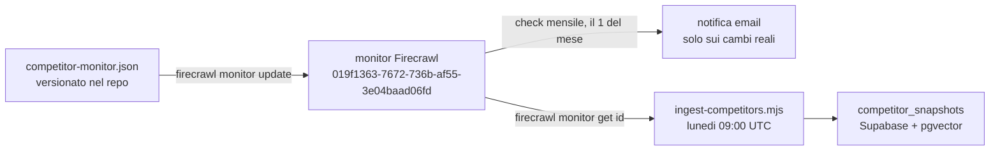

# Monitor competitor vetrerie

Monitor Firecrawl server-side (`firecrawl monitor`), id `019f1363-7672-736b-af55-3e04baad06fd`.
La configurazione riproducibile sta in [`competitor-monitor.json`](./competitor-monitor.json).

## Il monitor è la source of truth della lista URL

Questo monitor non serve solo alle notifiche di cambiamento.
`scripts/ingest-competitors.mjs` non ha una lista di URL propria: legge la stessa lista dal
monitor live con `firecrawl monitor get <id>` e ne appiattisce i `targets` (righe 23 e 32-33
dello script). Chi aggiunge o toglie un target qui cambia anche cosa finisce in
`competitor_snapshots` al run settimanale di `.github/workflows/ingest.yml` (cron `0 9 * * 1`,
lunedì 09:00 UTC).

## Configurazione

| Voce | Valore |
| --- | --- |
| Schedule | mensile, il 1° del mese alle 09:00 (`0 9 1 * *`, timezone `Europe/Rome`) |
| Target | 30 URL su 7 domini, in un unico target di tipo `scrape` |
| AI judge | attivo, guidato dal campo `goal` |
| Retention | 90 giorni (`retentionDays`) |
| Notifiche | email, destinatario in `notification.email.recipients` |

L'AI judge filtra il rumore, cioè testi di cookie e privacy, date e modifiche di sola
formattazione, e notifica solo i cambi reali a servizi, prodotti, prezzi e promozioni, oppure la
pubblicazione di un nuovo contenuto editoriale.

Le notifiche email di Firecrawl richiedono opt-in: il destinatario riceve una mail di conferma
da accettare una volta sola. Vanno applicate dopo il run mensile, altrimenti si perde il diff del
mese in corso.

Per riapplicare la configurazione, `firecrawl monitor update <id> competitor-monitor.json`
aggiorna i target, mentre il `goal` va passato a parte con il flag `--goal`.

## Budget crediti Firecrawl

Il monitor non è più l'unico consumo del piano. Da quando i due ingest girano ogni lunedì
condivide il piano da 1.000 crediti al mese con `ingest-competitors.mjs` e `ingest-site.mjs`.

| Voce | Calcolo | Crediti al mese |
| --- | --- | --- |
| Monitor competitor | 30 URL × 2 crediti (l'AI judge raddoppia) × 1 check | 60 |
| Ingest competitor, lunedì | 30 URL × 1 credito × 4,33 settimane | 130 |
| Ingest sito, lunedì | 29 URL × 1 credito × 4,33 settimane | 126 |
| Totale | | circa 316 su 1.000 |

Il monitor da solo pesa il 6% del piano, i tre consumi insieme circa il 32%. La conseguenza
pratica è che aggiungere un target qui costa più di quanto sembri: 2 crediti al mese per il
check, più circa 4,33 crediti al mese per l'ingest settimanale della stessa pagina.

`chunk-site.mjs` non compare in tabella perché non scrapa: deriva i chunk dal markdown già
presente in `site_pages` e non consuma crediti.

## Domini valutati e set monitorato

Il set è stato scelto mappando i domini candidati e tenendo solo le aree che cambiano davvero.

| Dominio | Zona | Profilo | Nel monitor | URL |
| --- | --- | --- | --- | --- |
| vetrariacasalese.it | Casale Monferrato | concorrente diretto, unico competitor presente in `seo_rankings` con 21 posizioni | si | 5 |
| lanuovavetrinova.it | | molte pagine di servizio | si | 5 |
| skyglass.it | fuori zona | blog SEO attivo su normative, bonus e vetrate | si | 5 |
| nuovavetrariaalessandrinasrl.it | Alessandria | statico, catalogo servizi | si | 4 |
| vetreriavegal.com | Alessandria | parapetti, scale, lavorazioni del vetro | si | 4 |
| vetreriabs.it | | statico, blog fermo | si | 4 |
| vercellivetri.it | Vercelli | shop e-commerce con blog, il più strutturato | si | 3 |
| vetreriasav.it | fuori territorio | blog attivo ma irrilevante per la SERP locale | no | 0 |
| glasmatt.it | | catalogo statico | no | 0 |
| vetreriavs.it | | pagine lavori, statico | no | 0 |
| vetreriacasale.it | | accessori e ferramenta, statico | no | 0 |
| vetreriabenedetti.it | | micro e-commerce PHP | no | 0 |

Il razionale delle inclusioni e delle esclusioni:

- skyglass.it è dentro pur essendo fuori zona, come fonte di intelligence editoriale: copre i
  topic informazionali (ecobonus, normative, vetrate panoramiche) utili al blog di Vetreria
  Monferrina.
- di vercellivetri.it è monitorato anche il blog, oltre a home e shop, perché è il competitor
  territoriale con la struttura più articolata.
- i quattro cataloghi statici sono esclusi: cambiano raramente e non giustificano i crediti.
- vetreriasav.it è escluso perché il blog è attivo, ma il territorio non è quello della SERP di
  riferimento.
